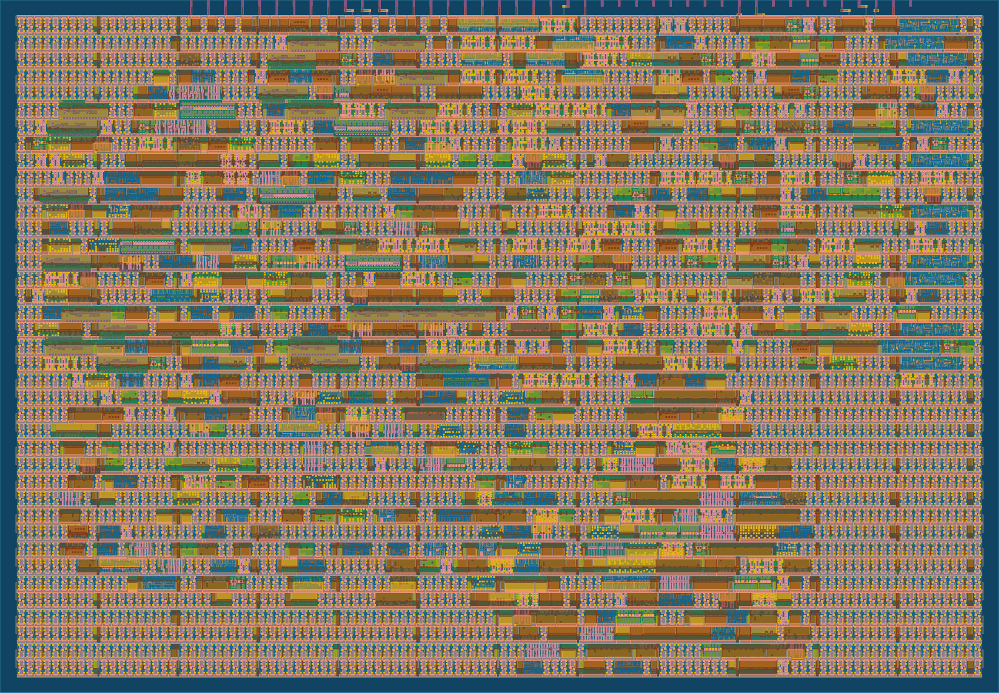
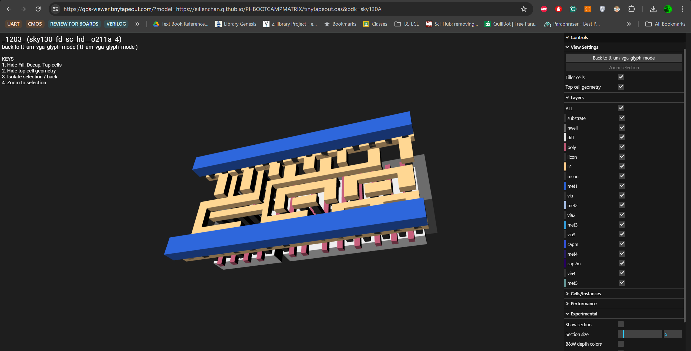
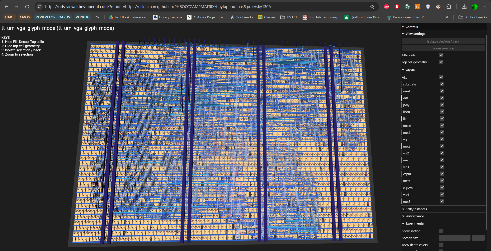

   

# Glyph Matrix

This project is a simple glyph matrix implementation created for the PH Bootcamp under the IEEE Open Silicon Cohort 1. The design displays custom text using a basic glyph-based matrix approach, featuring my name and the words “PH BootCamp” as part of the visual output. Through this activity, I was able to practice Verilog coding, understand how characters can be represented as pixel patterns, and gain hands-on experience in creating simple display logic.

You can try it here: https://vga-playground.com/?repo=https://github.com/eillenchan/PHBOOTCAMPMATRIX/

## GDS Layout Preview

The design was also viewed using the TinyTapeout GDS viewer to check its physical layout after generation. This allowed me to inspect the chip layout in both 2D and 3D views, including the different metal layers, cells, routing, and overall structure of the design. By checking the GDS preview, I was able to better understand how the Verilog design is translated into an actual silicon layout and how digital logic can be prepared for possible chip fabrication through TinyTapeout.

### 2D Layout Preview

### 3D Layout Preview

### Full 3D Layout View

