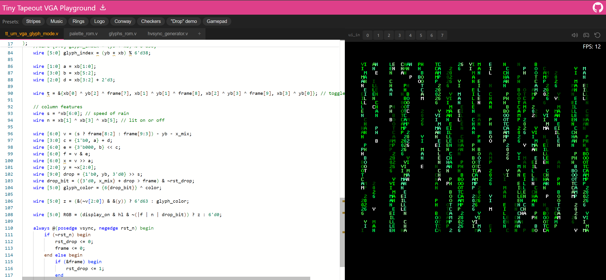

   

# Glyph Matrix with my Name

This project is a simple glyph matrix implementation created for the PH Bootcamp under the IEEE Open Silicon Cohort 1. The design displays custom text using a basic glyph-based matrix approach, featuring my name and the words “PH BootCamp” as part of the visual output. Through this activity, I was able to practice Verilog coding, understand how characters can be represented as pixel patterns, and gain hands-on experience in creating simple display logic.

You can try it here: https://vga-playground.com/?repo=https://github.com/eillenchan/PHBOOTCAMPMATRIX/
